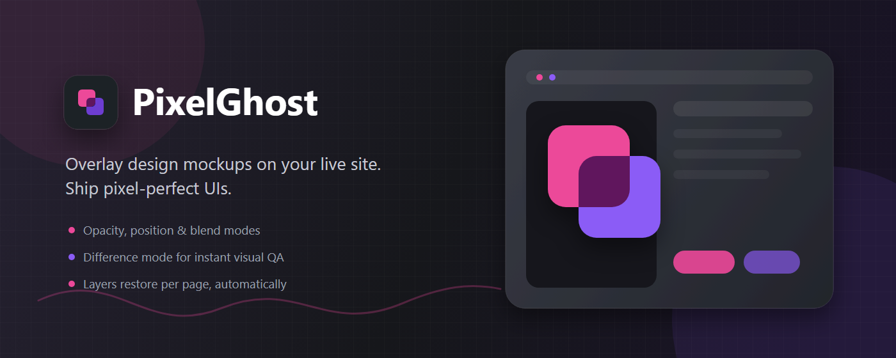

# PixelGhost

PixelGhost (listed in extension stores as **PixelGhost: Pixel Perfect Design
QA & Multi-Layer**) is a browser extension for comparing a reference image
with a live web page. Designers and frontend developers can place image
overlays over normal HTTP and HTTPS pages, then adjust their position,
opacity, scale, rotation, visibility, lock state, and blend mode to spot
pixel-level mismatches between a design and its implementation.

The extension is local-first. Page URLs and workspace data, local overlay
images, remote image addresses, named projects, and comparison settings are
stored in the browser profile. If a user supplies an HTTPS image URL, the
browser requests that image directly from the selected server. There is no
PixelGhost account, analytics service, advertising SDK, or developer-operated
data server. See [PRIVACY.md](PRIVACY.md) for the complete privacy policy.

This repository hosts PixelGhost's public privacy policy, third-party
notices, and store listing assets. It does not contain the extension's
source code.

## Features

- Add overlays from local image files, a folder, the clipboard, or an HTTPS
  image URL.
- Manage multiple layers from the popup and the on-page floating widget.
- Adjust opacity, X/Y position, scale, visibility, lock state, and CSS blend
  mode (Normal, Invert, Difference, Multiply, Overlay).
- Rotate a layer left or right in 90° steps.
- Lock an overlay for scroll-based comparison or leave it viewport-relative.
- Autosave a workspace for each page URL and save reusable named projects.
- Review every URL with saved layers in the popup's saved-layers list, and
  delete the saved layers for one URL or for all URLs at once.
- Use light and dark themes with five accent colors, and the
  `Ctrl+Shift+Down` popup shortcut.

PixelGhost works on ordinary `http://` and `https://` pages. Browser-internal
pages, extension stores, and other restricted pages do not allow content
script injection.

## Storage and permissions

- IndexedDB stores URL-keyed workspaces, image blobs, thumbnails, and named
  projects.
- `chrome.storage.local` stores first-use consent and global widget, theme,
  and accent-color preferences.
- Popup `localStorage` stores the selected theme and accent color after
  first-use consent.
- HTTP/HTTPS page access is used to render overlays and associate a locally
  saved workspace with the current page URL.
- Rendered overlay elements and widget data live in the current page DOM while
  active and may be inspectable by scripts on that page. Use confidential
  designs only on pages you trust.
- Clipboard read access is optional and requested only when the user selects
  the **Paste** action. Ordinary `Ctrl+V` paste remains available without the
  optional permission.

## Documentation

- [Support and issue reporting](ISSUES.md)
- [Privacy policy](PRIVACY.md)
- [Third-party notices](THIRD_PARTY_NOTICES.md)

## Contact

Questions, privacy requests, and support: <codecube99@gmail.com>

## License

PixelGhost is licensed under the Apache License 2.0. See [LICENSE](LICENSE).
Third-party components retain their own licenses as listed in
[THIRD_PARTY_NOTICES.md](THIRD_PARTY_NOTICES.md).
